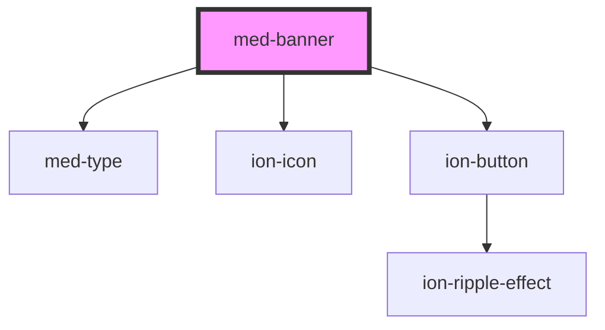

# med-banner

<!-- Auto Generated Below -->

## Properties

| Property                | Attribute   | Description | Type                  | Default     |
| ----------------------- | ----------- | ----------- | --------------------- | ----------- |
| `btnLeft` _(required)_  | `btn-left`  | todo        | `string`              | `undefined` |
| `btnRight` _(required)_ | `btn-right` | todo        | `string`              | `undefined` |
| `dsColor`               | `ds-color`  | todo        | `string \| undefined` | `undefined` |
| `icon` _(required)_     | `icon`      | todo        | `string`              | `undefined` |
| `image` _(required)_    | `image`     | todo        | `string`              | `undefined` |
| `texto`                 | `texto`     | todo        | `string \| undefined` | `undefined` |
| `titulo`                | `titulo`    | todo        | `string \| undefined` | `undefined` |

## Events

| Event           | Description | Type                |
| --------------- | ----------- | ------------------- |
| `btnLeftClick`  | todo        | `CustomEvent<void>` |
| `btnRightClick` | todo        | `CustomEvent<void>` |

## Dependencies

### Depends on

- [med-type](../../core/med-type)
- ion-icon
- [ion-button](../../../button)

### Graph

----------------------------------------------

*Built with [StencilJS](https://stenciljs.com/)*
