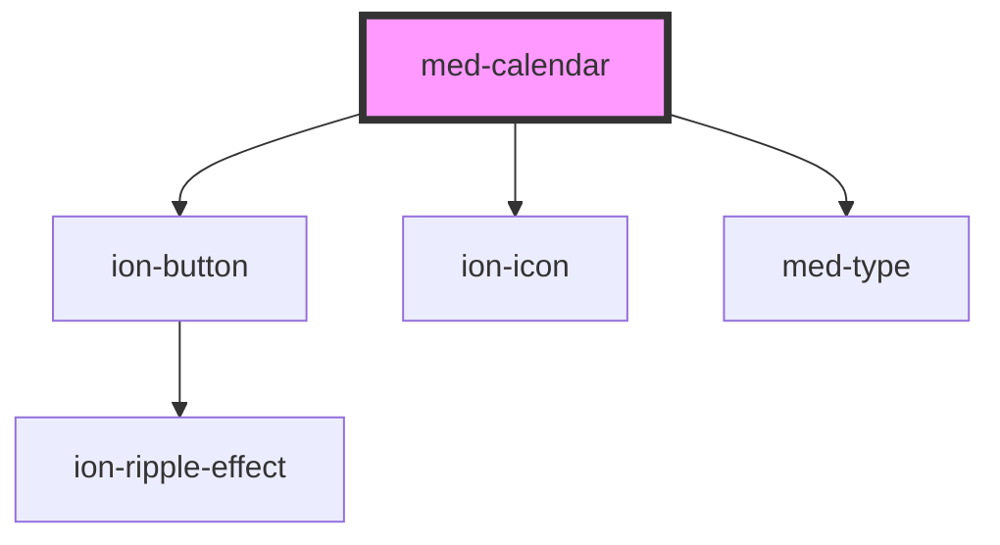

# med-calendar

<!-- Auto Generated Below -->

## Properties

| Property    | Attribute   | Description | Type                  | Default     |
| ----------- | ----------- | ----------- | --------------------- | ----------- |
| `ano`       | `ano`       | todo        | `string \| undefined` | `undefined` |
| `choice`    | `choice`    | todo        | `string`              | `'Semana'`  |
| `container` | `container` | todo        | `string \| undefined` | `undefined` |
| `disable`   | `disable`   | todo        | `boolean`             | `false`     |
| `dsColor`   | `ds-color`  | todo        | `string \| undefined` | `undefined` |
| `mes`       | `mes`       | todo        | `string \| undefined` | `undefined` |

## Events

| Event      | Description | Type               |
| ---------- | ----------- | ------------------ |
| `medClick` | todo        | `CustomEvent<any>` |
| `medSwipe` | todo        | `CustomEvent<any>` |

## Dependencies

### Depends on

- [ion-button](../../../button)
- ion-icon
- [med-type](../../core/med-type)

### Graph

----------------------------------------------

*Built with [StencilJS](https://stenciljs.com/)*
