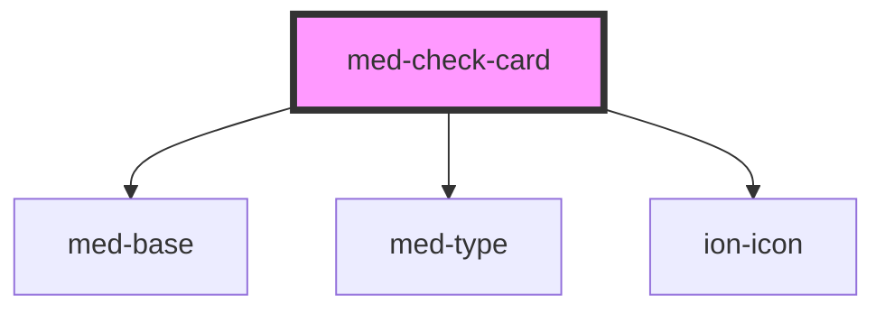

# med-check-card

<!-- Auto Generated Below -->

## Properties

| Property      | Attribute      | Description | Type                  | Default     |
| ------------- | -------------- | ----------- | --------------------- | ----------- |
| `alert`       | `alert`        | todo        | `boolean`             | `false`     |
| `categoria`   | `categoria`    | todo        | `string \| undefined` | `undefined` |
| `dataFinal`   | `data-final`   | todo        | `string \| undefined` | `undefined` |
| `dataInicial` | `data-inicial` | todo        | `string \| undefined` | `undefined` |
| `dsColor`     | `ds-color`     | todo        | `string \| undefined` | `undefined` |
| `finalizada`  | `finalizada`   | todo        | `string \| undefined` | `undefined` |
| `horaFinal`   | `hora-final`   | todo        | `string \| undefined` | `undefined` |
| `horaInicial` | `hora-inicial` | todo        | `string \| undefined` | `undefined` |
| `iconName`    | `icon-name`    | todo        | `string \| undefined` | `undefined` |
| `titulo`      | `titulo`       | todo        | `string \| undefined` | `undefined` |

## Events

| Event             | Description | Type               |
| ----------------- | ----------- | ------------------ |
| `medClick`        | todo        | `CustomEvent<any>` |
| `medTooltipClose` | todo        | `CustomEvent<any>` |

## Dependencies

### Depends on

- [med-base](../../core/med-base)
- [med-type](../../core/med-type)
- ion-icon

### Graph

----------------------------------------------

*Built with [StencilJS](https://stenciljs.com/)*
