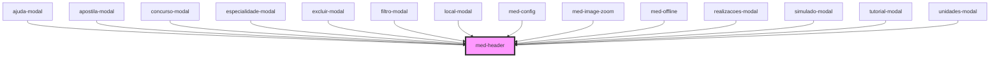

# med-header

<!-- Auto Generated Below -->

## Events

| Event       | Description | Type                                   |
| ----------- | ----------- | -------------------------------------- |
| `medResize` | todo        | `CustomEvent<headerResizeEventDetail>` |

## Dependencies

### Used by

 - [ajuda-modal](../../ionic-1-migracao/simulados/ajuda-modal)
 - [apostila-modal](../../ionic-1-migracao/duvidas-academicas/apostila-modal)
 - [concurso-modal](../../ionic-1-migracao/duvidas-academicas/concurso-modal)
 - [especialidade-modal](../../ionic-1-migracao/simulados/especialidade-modal)
 - [excluir-modal](../../ionic-1-migracao/duvidas-academicas/excluir-modal)
 - [filtro-modal](../../ionic-1-migracao/duvidas-academicas/filtro-modal)
 - [local-modal](../../ionic-1-migracao/simulados/local-modal)
 - [med-config](../../legacy/med-config)
 - [med-image-zoom](../med-image-zoom)
 - [med-offline](../med-offline)
 - [realizacoes-modal](../../ionic-1-migracao/simulados/realizacoes-modal)
 - [simulado-modal](../../ionic-1-migracao/duvidas-academicas/simulado-modal)
 - [tutorial-modal](../../ionic-1-migracao/simulados/tutorial-modal)
 - [unidades-modal](../../ionic-1-migracao/simulados/unidades-modal)

### Graph

----------------------------------------------

*Built with [StencilJS](https://stenciljs.com/)*
