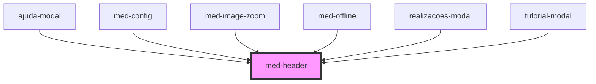

# med-header

<!-- Auto Generated Below -->

## Events

| Event       | Description | Type                                   |
| ----------- | ----------- | -------------------------------------- |
| `medResize` | todo        | `CustomEvent<headerResizeEventDetail>` |

## Dependencies

### Used by

 - [ajuda-modal](../../ionic-1-migracao/simulados/ajuda-modal)
 - [med-config](../../legacy/med-config)
 - [med-image-zoom](../med-image-zoom)
 - [med-offline](../med-offline)
 - [realizacoes-modal](../../ionic-1-migracao/simulados/realizacoes-modal)
 - [tutorial-modal](../../ionic-1-migracao/simulados/tutorial-modal)

### Graph

----------------------------------------------

*Built with [StencilJS](https://stenciljs.com/)*
