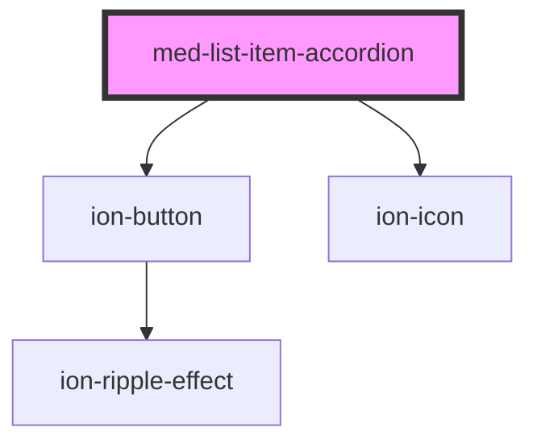

# med-list-item-accordion

<!-- Auto Generated Below -->

## Properties

| Property    | Attribute   | Description | Type                                        | Default     |
| ----------- | ----------- | ----------- | ------------------------------------------- | ----------- |
| `border`    | `border`    | todo        | `boolean`                                   | `false`     |
| `collapsed` | `collapsed` | todo        | `boolean`                                   | `true`      |
| `disabled`  | `disabled`  | todo        | `boolean`                                   | `false`     |
| `dsColor`   | `ds-color`  | todo        | `string \| undefined`                       | `undefined` |
| `dsSize`    | `ds-size`   | todo        | `"md" \| "sm" \| "xs" \| undefined`         | `undefined` |
| `label`     | `label`     | todo        | `string \| undefined`                       | `undefined` |
| `margin`    | `margin`    | todo        | `"lg" \| "md" \| "sm" \| "xs" \| undefined` | `undefined` |
| `selected`  | `selected`  | todo        | `boolean`                                   | `false`     |
| `titulo`    | `titulo`    | todo        | `string \| undefined`                       | `undefined` |

## Methods

### `toggle(event?: Event) => Promise<void>`

todo

#### Returns

Type: `Promise<void>`

## Dependencies

### Depends on

- [ion-button](../../../button)
- ion-icon

### Graph

----------------------------------------------

*Built with [StencilJS](https://stenciljs.com/)*
