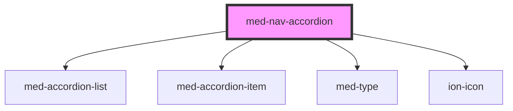

# med-nav-accordion

<!-- Auto Generated Below -->

## Properties

| Property  | Attribute  | Description | Type                  | Default     |
| --------- | ---------- | ----------- | --------------------- | ----------- |
| `dsColor` | `ds-color` | todo        | `string \| undefined` | `undefined` |
| `titulo`  | `titulo`   |             | `string \| undefined` | `undefined` |

## Dependencies

### Depends on

- [med-accordion-list](../med-accordion-list)
- [med-accordion-item](../med-accordion-item)
- [med-type](../../core/med-type)
- ion-icon

### Graph

----------------------------------------------

*Built with [StencilJS](https://stenciljs.com/)*
