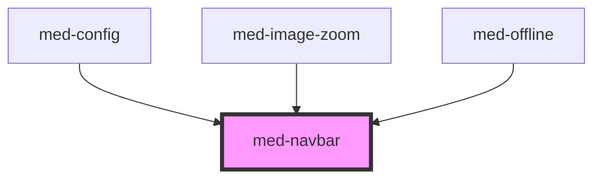

# med-navbar

<!-- Auto Generated Below -->

## Properties

| Property  | Attribute  | Description | Type                                        | Default     |
| --------- | ---------- | ----------- | ------------------------------------------- | ----------- |
| `dsColor` | `ds-color` | todo        | `string \| undefined`                       | `undefined` |
| `dsName`  | `ds-name`  | todo        | `"secondary" \| "transparent" \| undefined` | `undefined` |

## Dependencies

### Used by

 - [med-config](../../legacy/med-config)
 - [med-image-zoom](../med-image-zoom)
 - [med-offline](../med-offline)

### Graph

----------------------------------------------

*Built with [StencilJS](https://stenciljs.com/)*
