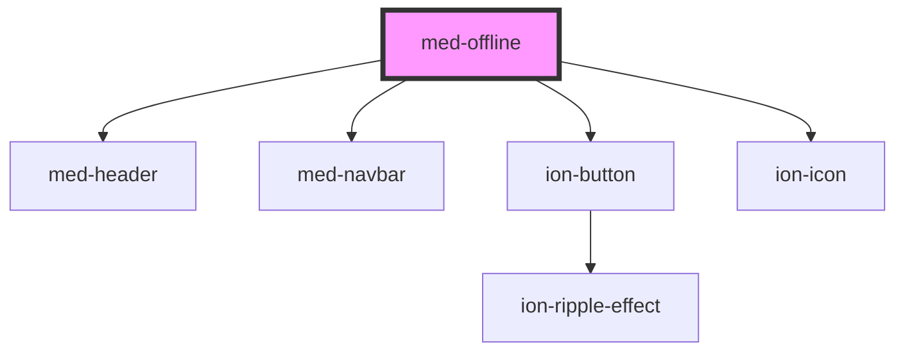

# med-offline

<!-- Auto Generated Below -->

## Properties

| Property    | Attribute   | Description | Type     | Default                                                 |
| ----------- | ----------- | ----------- | -------- | ------------------------------------------------------- |
| `subtitulo` | `subtitulo` | todo        | `string` | `'Você está offline'`                                   |
| `texto`     | `texto`     | todo        | `string` | `'Conecte-se à internet para visualizar esse conteúdo'` |
| `titulo`    | `titulo`    | todo        | `string` | `'Página Indisponível'`                                 |

## Events

| Event      | Description | Type                |
| ---------- | ----------- | ------------------- |
| `medClick` | todo        | `CustomEvent<void>` |

## Dependencies

### Depends on

- [med-header](../med-header)
- [med-navbar](../med-navbar)
- [ion-button](../../../button)
- ion-icon

### Graph

----------------------------------------------

*Built with [StencilJS](https://stenciljs.com/)*
