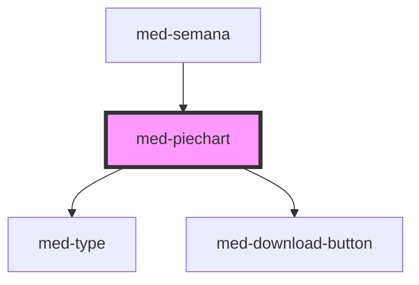

# med-piechart

<!-- Auto Generated Below -->

## Properties

| Property           | Attribute           | Description | Type                            | Default     |
| ------------------ | ------------------- | ----------- | ------------------------------- | ----------- |
| `disabled`         | `disabled`          | todo        | `boolean`                       | `false`     |
| `download`         | `download`          | todo        | `boolean`                       | `false`     |
| `downloadProgress` | `download-progress` | todo        | `number`                        | `0`         |
| `downloaded`       | `downloaded`        | todo        | `boolean`                       | `false`     |
| `dsColor`          | `ds-color`          | todo        | `string \| undefined`           | `undefined` |
| `dsSize`           | `ds-size`           | todo        | `"sm" \| undefined`             | `undefined` |
| `hideDownload`     | `hide-download`     | todo        | `boolean`                       | `false`     |
| `identification`   | `identification`    | todo        | `number \| string \| undefined` | `undefined` |
| `index`            | `index`             | todo        | `number \| undefined`           | `undefined` |
| `label`            | `label`             | todo        | `string \| undefined`           | `undefined` |
| `value`            | `value`             | todo        | `number`                        | `0`         |

## Methods

### `toggle(event?: Event | undefined) => Promise<void>`

todo

#### Returns

Type: `Promise<void>`

## Dependencies

### Used by

 - [med-semana](../med-semana)

### Depends on

- [med-type](../../core/med-type)
- [med-download-button](../../core/med-download-button)

### Graph

----------------------------------------------

*Built with [StencilJS](https://stenciljs.com/)*
