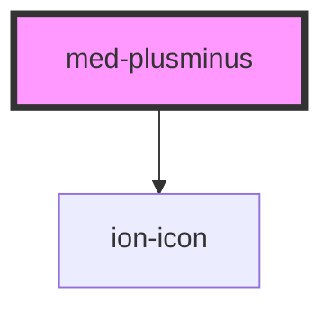

# monta-provas-plusminus

<!-- Auto Generated Below -->

## Properties

| Property            | Attribute            | Description                                                                                  | Type                                       | Default     |
| ------------------- | -------------------- | -------------------------------------------------------------------------------------------- | ------------------------------------------ | ----------- |
| `automaticDisabled` | `automatic-disabled` | true se deve desabilitar os controles automaticamente                                        | `boolean`                                  | `false`     |
| `disabled`          | `disabled`           | todo                                                                                         | `"both" \| "minus" \| "plus" \| undefined` | `undefined` |
| `dsColor`           | `ds-color`           | todo                                                                                         | `string \| undefined`                      | `undefined` |
| `dsSize`            | `ds-size`            | todo                                                                                         | `"xl" \| undefined`                        | `undefined` |
| `max`               | `max`                | O valor máximo                                                                               | `number \| undefined`                      | `undefined` |
| `min`               | `min`                | O valor mínimo                                                                               | `number \| undefined`                      | `undefined` |
| `useSlot`           | `use-slot`           | Deverá ser true se o valor atual vai ser passado por slot, false se vai ser passado por prop | `boolean`                                  | `true`      |
| `value`             | `value`              | O valor atual (apenas se useSlot é false)                                                    | `number \| undefined`                      | `undefined` |

## Events

| Event          | Description | Type                                                         |
| -------------- | ----------- | ------------------------------------------------------------ |
| `medChange`    | todo        | `CustomEvent<PlusMinusStatus.MINUS \| PlusMinusStatus.PLUS>` |
| `medChangeAlt` | todo        | `CustomEvent<number>`                                        |

## Dependencies

### Depends on

- ion-icon

### Graph

----------------------------------------------

*Built with [StencilJS](https://stenciljs.com/)*
