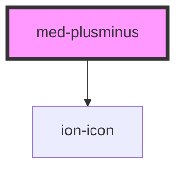

# monta-provas-plusminus

<!-- Auto Generated Below -->

## Properties

| Property   | Attribute  | Description | Type                                       | Default     |
| ---------- | ---------- | ----------- | ------------------------------------------ | ----------- |
| `disabled` | `disabled` | todo        | `"both" \| "minus" \| "plus" \| undefined` | `undefined` |
| `dsColor`  | `ds-color` | todo        | `string \| undefined`                      | `undefined` |
| `dsSize`   | `ds-size`  | todo        | `"xl" \| undefined`                        | `undefined` |

## Events

| Event       | Description | Type                                                         |
| ----------- | ----------- | ------------------------------------------------------------ |
| `medChange` | todo        | `CustomEvent<PlusMinusStatus.MINUS \| PlusMinusStatus.PLUS>` |

## Dependencies

### Depends on

- ion-icon

### Graph

----------------------------------------------

*Built with [StencilJS](https://stenciljs.com/)*
