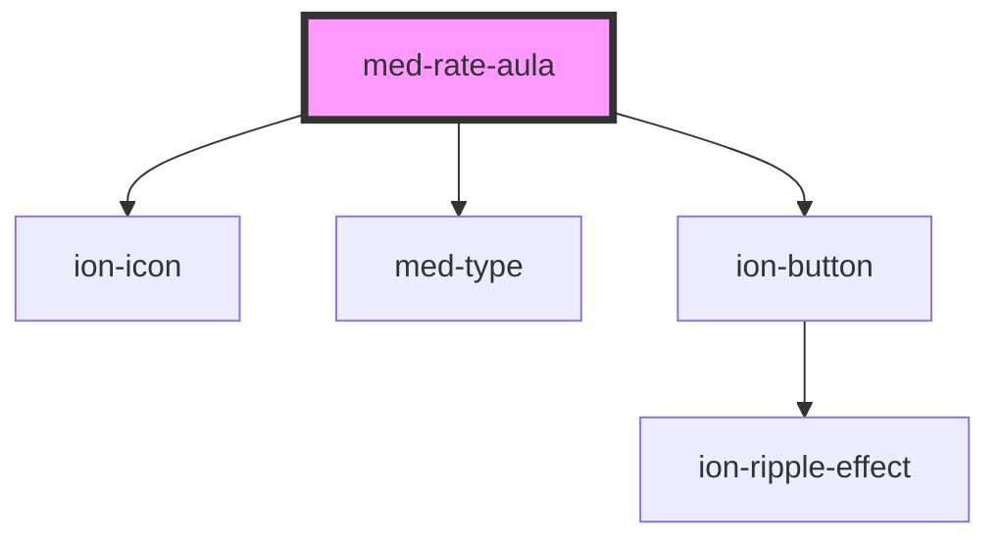

# med-rate-aula

<!-- Auto Generated Below -->

## Properties

| Property    | Attribute   | Description | Type      | Default |
| ----------- | ----------- | ----------- | --------- | ------- |
| `collapsed` | `collapsed` | todo        | `boolean` | `false` |

## Methods

### `toggle(event?: Event | undefined) => Promise<void>`

todo

#### Returns

Type: `Promise<void>`

## Dependencies

### Depends on

- ion-icon
- [med-type](../../core/med-type)
- [ion-button](../../../button)

### Graph

----------------------------------------------

*Built with [StencilJS](https://stenciljs.com/)*
