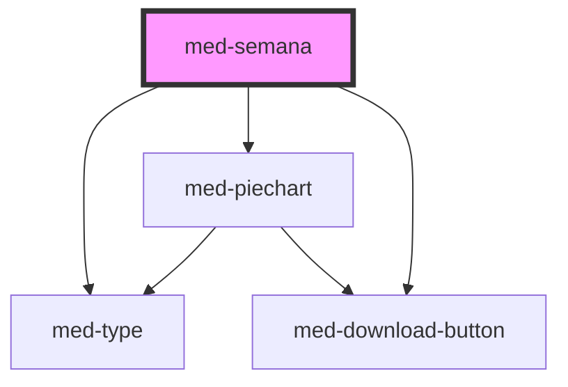

# med-semana

<!-- Auto Generated Below -->

## Properties

| Property               | Attribute       | Description | Type                   | Default     |
| ---------------------- | --------------- | ----------- | ---------------------- | ----------- |
| `active`               | `active`        | todo        | `boolean`              | `false`     |
| `content` _(required)_ | --              | todo        | `MedSemanaInterface`   | `undefined` |
| `disabled`             | `disabled`      | todo        | `boolean`              | `false`     |
| `dsColor`              | `ds-color`      | todo        | `string \| undefined`  | `undefined` |
| `dsSize`               | `ds-size`       | todo        | `"sm" \| undefined`    | `undefined` |
| `hideDownload`         | `hide-download` | todo        | `boolean`              | `false`     |
| `skin`                 | `skin`          | todo        | `"lista" \| undefined` | `undefined` |

## Dependencies

### Depends on

- [med-type](../../core/med-type)
- [med-piechart](../med-piechart)
- [med-download-button](../../core/med-download-button)

### Graph

----------------------------------------------

*Built with [StencilJS](https://stenciljs.com/)*
