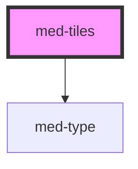

# med-tiles

<!-- Auto Generated Below -->

## Properties

| Property   | Attribute  | Description | Type                  | Default     |
| ---------- | ---------- | ----------- | --------------------- | ----------- |
| `badge`    | `badge`    | todo        | `string \| undefined` | `undefined` |
| `dsColor`  | `ds-color` | todo        | `string \| undefined` | `undefined` |
| `label`    | `label`    | todo        | `string \| undefined` | `undefined` |
| `selected` | `selected` | todo        | `boolean`             | `false`     |
| `solid`    | `solid`    | todo        | `boolean`             | `false`     |
| `titulo`   | `titulo`   | todo        | `string \| undefined` | `undefined` |

## Dependencies

### Depends on

- [med-type](../../core/med-type)

### Graph

----------------------------------------------

*Built with [StencilJS](https://stenciljs.com/)*
