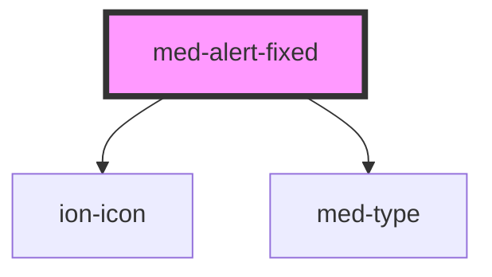

# med-alert-fixed

<!-- Auto Generated Below -->

## Properties

| Property         | Attribute         | Description | Type                                    | Default                                                    |
| ---------------- | ----------------- | ----------- | --------------------------------------- | ---------------------------------------------------------- |
| `dsColor`        | `ds-color`        | todo        | `string \| undefined`                   | `undefined`                                                |
| `dsName`         | `ds-name`         | todo        | `"atualizar" \| "offline" \| undefined` | `undefined`                                                |
| `labelAtualizar` | `label-atualizar` | todo        | `string`                                | `'Versão desatualizada'`                                   |
| `labelOffline`   | `label-offline`   | todo        | `string`                                | `'Você está offline. Conecte-se para acessar o conteúdo.'` |

## Dependencies

### Depends on

- ion-icon
- [med-type](../med-type)

### Graph

----------------------------------------------

*Built with [StencilJS](https://stenciljs.com/)*
