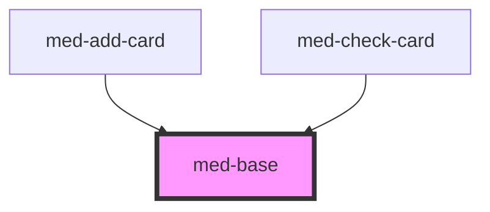

# med-base

<!-- Auto Generated Below -->

## Properties

| Property   | Attribute   | Description | Type                  | Default     |
| ---------- | ----------- | ----------- | --------------------- | ----------- |
| `dsColor`  | `ds-color`  | todo        | `string \| undefined` | `undefined` |
| `gap`      | `gap`       | todo        | `string \| undefined` | `undefined` |
| `radius`   | `radius`    | todo        | `string \| undefined` | `undefined` |
| `spacingH` | `spacing-h` | todo        | `string \| undefined` | `undefined` |
| `spacingV` | `spacing-v` | todo        | `string \| undefined` | `undefined` |

## Dependencies

### Used by

 - [med-add-card](../../compositions/med-add-card)
 - [med-check-card](../../compositions/med-check-card)

### Graph

----------------------------------------------

*Built with [StencilJS](https://stenciljs.com/)*
