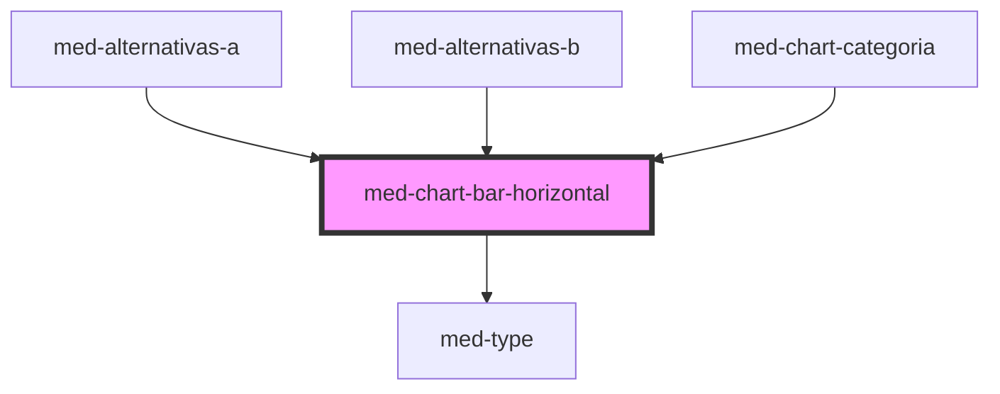

# chart-bar-horizontal

<!-- Auto Generated Below -->

## Properties

| Property       | Attribute       | Description | Type                  | Default     |
| -------------- | --------------- | ----------- | --------------------- | ----------- |
| `dsColor`      | `ds-color`      | todo        | `string \| undefined` | `undefined` |
| `dsSize`       | `ds-size`       | todo        | `"md" \| undefined`   | `undefined` |
| `hideValue`    | `hide-value`    | todo        | `boolean`             | `false`     |
| `label`        | `label`         | todo        | `boolean`             | `true`      |
| `labelContent` | `label-content` | todo        | `string \| undefined` | `undefined` |
| `value`        | `value`         | todo        | `number`              | `0`         |

## Dependencies

### Used by

 - [med-alternativas-a](../../team/questoes/med-alternativas-a)
 - [med-alternativas-b](../../team/questoes/med-alternativas-b)
 - [med-chart-categoria](../../compositions/med-chart-categoria)

### Depends on

- [med-type](../med-type)

### Graph

----------------------------------------------

*Built with [StencilJS](https://stenciljs.com/)*
