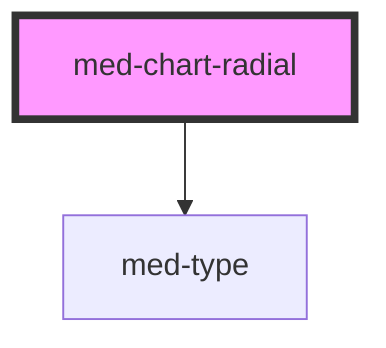

# med-chart-radial

<!-- Auto Generated Below -->

## Properties

| Property    | Attribute   | Description | Type                                        | Default     |
| ----------- | ----------- | ----------- | ------------------------------------------- | ----------- |
| `dsColor`   | `ds-color`  | todo        | `string \| undefined`                       | `undefined` |
| `dsName`    | `ds-name`   | todo        | `"secondary" \| undefined`                  | `undefined` |
| `dsSize`    | `ds-size`   | todo        | `"lg" \| "md" \| "sm" \| "xs" \| undefined` | `undefined` |
| `subtitulo` | `subtitulo` | todo        | `string \| undefined`                       | `undefined` |
| `titulo`    | `titulo`    | todo        | `string \| undefined`                       | `undefined` |
| `valores`   | --          | todo        | `MedChartRadiaItem[]`                       | `[]`        |

## Dependencies

### Depends on

- [med-type](../med-type)

### Graph

----------------------------------------------

*Built with [StencilJS](https://stenciljs.com/)*
