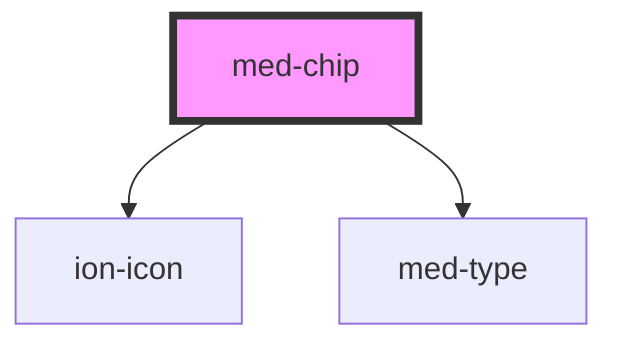

# ion-chip

Chips represent complex entities in small blocks, such as a contact. A chip can contain several different elements such as avatars, text, and icons.

<!-- Auto Generated Below -->

## Properties

| Property                 | Attribute    | Description | Type                       | Default     |
| ------------------------ | ------------ | ----------- | -------------------------- | ----------- |
| `active`                 | `active`     | todo        | `boolean`                  | `false`     |
| `disabled`               | `disabled`   | todo        | `boolean`                  | `false`     |
| `dsColor`                | `ds-color`   | todo        | `string \| undefined`      | `undefined` |
| `dsName`                 | `ds-name`    | todo        | `"secondary" \| undefined` | `undefined` |
| `dsSize`                 | `ds-size`    | todo        | `"md" \| undefined`        | `undefined` |
| `iconLeft` _(required)_  | `icon-left`  | todo        | `string`                   | `undefined` |
| `iconRight` _(required)_ | `icon-right` | todo        | `string`                   | `undefined` |
| `label` _(required)_     | `label`      | todo        | `string`                   | `undefined` |

## Events

| Event      | Description | Type                |
| ---------- | ----------- | ------------------- |
| `medBlur`  | todo        | `CustomEvent<void>` |
| `medClick` | todo        | `CustomEvent<void>` |
| `medFocus` | todo        | `CustomEvent<void>` |

## Dependencies

### Depends on

- ion-icon
- [med-type](../med-type)

### Graph

----------------------------------------------

*Built with [StencilJS](https://stenciljs.com/)*
