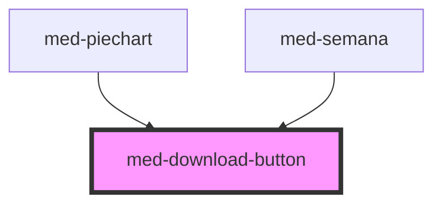

# med-download-button

<!-- Auto Generated Below -->

## Properties

| Property         | Attribute        | Description | Type                            | Default     |
| ---------------- | ---------------- | ----------- | ------------------------------- | ----------- |
| `disabled`       | `disabled`       | todo        | `boolean`                       | `false`     |
| `downloaded`     | `downloaded`     | todo        | `boolean`                       | `false`     |
| `downloading`    | `downloading`    | todo        | `boolean`                       | `false`     |
| `dsColor`        | `ds-color`       | todo        | `string \| undefined`           | `undefined` |
| `identification` | `identification` | todo        | `number \| string \| undefined` | `undefined` |
| `index`          | `index`          | todo        | `number \| undefined`           | `undefined` |
| `initial`        | `initial`        | todo        | `boolean`                       | `true`      |
| `value`          | `value`          | todo        | `number`                        | `0`         |

## Events

| Event            | Description | Type               |
| ---------------- | ----------- | ------------------ |
| `medCancelar`    | todo        | `CustomEvent<any>` |
| `medDownloaded`  | todo        | `CustomEvent<any>` |
| `medDownloading` | todo        | `CustomEvent<any>` |

## Dependencies

### Used by

 - [med-piechart](../../compositions/med-piechart)
 - [med-semana](../../compositions/med-semana)

### Graph

----------------------------------------------

*Built with [StencilJS](https://stenciljs.com/)*
