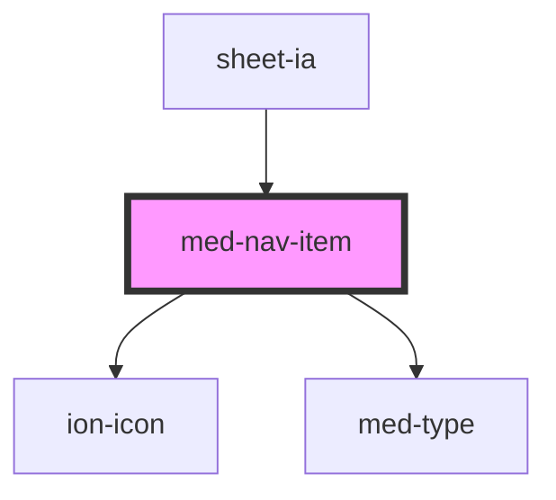

# med-nav-item

<!-- Auto Generated Below -->

## Properties

| Property          | Attribute          | Description | Type                                                    | Default     |
| ----------------- | ------------------ | ----------- | ------------------------------------------------------- | ----------- |
| `active`          | `active`           | todo        | `boolean`                                               | `false`     |
| `disabled`        | `disabled`         | todo        | `boolean`                                               | `false`     |
| `dsColor`         | `ds-color`         | todo        | `string \| undefined`                                   | `undefined` |
| `icon`            | `icon`             | todo        | `string \| undefined`                                   | `undefined` |
| `iconOnly`        | `icon-only`        | todo        | `boolean`                                               | `false`     |
| `routerAnimation` | --                 | todo        | `((baseEl: any, opts?: any) => Animation) \| undefined` | `undefined` |
| `routerDirection` | `router-direction` | todo        | `"back" \| "forward" \| "root"`                         | `'forward'` |
| `text`            | `text`             | todo        | `string \| undefined`                                   | `undefined` |

## Events

| Event      | Description | Type                |
| ---------- | ----------- | ------------------- |
| `medBlur`  | todo        | `CustomEvent<void>` |
| `medClick` | todo        | `CustomEvent<void>` |
| `medFocus` | todo        | `CustomEvent<void>` |

## Dependencies

### Used by

 - [sheet-ia](../../testes/sheet-ia)

### Depends on

- ion-icon
- [med-type](../med-type)

### Graph

----------------------------------------------

*Built with [StencilJS](https://stenciljs.com/)*
