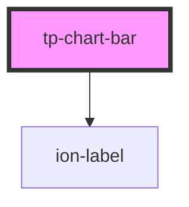

# med-chart-bar

<!-- Auto Generated Below -->

## Properties

| Property    | Attribute    | Description | Type                       | Default                                                  |
| ----------- | ------------ | ----------- | -------------------------- | -------------------------------------------------------- |
| `bar`       | --           | todo        | `TpChartBarItem`           | `{     color: "med-color-brand-4",     value: 0,   }`    |
| `dsColor`   | `ds-color`   | todo        | `string \| undefined`      | `undefined`                                              |
| `dsName`    | `ds-name`    | todo        | `"secondary" \| undefined` | `undefined`                                              |
| `hasMarker` | `has-marker` | todo        | `boolean`                  | `false`                                                  |
| `height`    | `height`     | todo        | `number`                   | `200`                                                    |
| `label`     | `label`      | todo        | `string \| undefined`      | `undefined`                                              |
| `labelSize` | `label-size` | todo        | `number`                   | `10`                                                     |
| `marker`    | --           | todo        | `TpChartBarItem`           | `{     color: "med-color-fb-caution",     value: 0,   }` |

## Dependencies

### Depends on

- [ion-label](../../../label)

### Graph

----------------------------------------------

*Built with [StencilJS](https://stenciljs.com/)*
