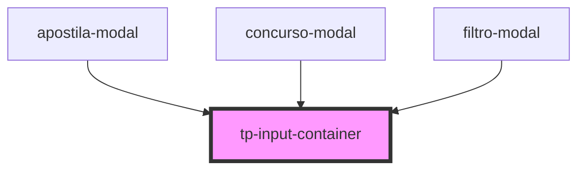

# tp-input-container

<!-- Auto Generated Below -->

## Properties

| Property    | Attribute    | Description | Type                                      | Default     |
| ----------- | ------------ | ----------- | ----------------------------------------- | ----------- |
| `disabled`  | `disabled`   | todo        | `boolean`                                 | `false`     |
| `dsColor`   | `ds-color`   | todo        | `string \| undefined`                     | `undefined` |
| `dsName`    | `ds-name`    | todo        | `"secondary" \| undefined`                | `undefined` |
| `feedback`  | `feedback`   | todo        | `boolean`                                 | `false`     |
| `hasButton` | `has-button` | todo        | `"both" \| "end" \| "start" \| undefined` | `undefined` |
| `hasIcon`   | `has-icon`   | todo        | `"both" \| "end" \| "start" \| undefined` | `undefined` |
| `inverted`  | `inverted`   | todo        | `boolean`                                 | `false`     |

## Dependencies

### Used by

 - [apostila-modal](../../ionic-1-migracao/duvidas-academicas/apostila-modal)
 - [concurso-modal](../../ionic-1-migracao/duvidas-academicas/concurso-modal)
 - [filtro-modal](../../ionic-1-migracao/duvidas-academicas/filtro-modal)

### Graph

----------------------------------------------

*Built with [StencilJS](https://stenciljs.com/)*
