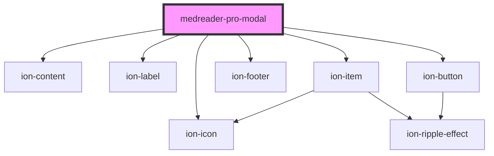

# medreader-pro-modal

<!-- Auto Generated Below -->

## Dependencies

### Depends on

- [ion-content](../../../../content)
- [ion-label](../../../../label)
- [ion-item](../../../../item)
- ion-icon
- [ion-footer](../../../../footer)
- [ion-button](../../../../button)

### Graph

----------------------------------------------

*Built with [StencilJS](https://stenciljs.com/)*
