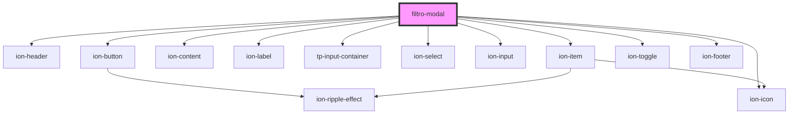

# filtro-modal

<!-- Auto Generated Below -->

## Dependencies

### Depends on

- [ion-header](../../../../header)
- [ion-button](../../../../button)
- ion-icon
- [ion-content](../../../../content)
- [ion-label](../../../../label)
- [tp-input-container](../../../core/tp-input-container)
- [ion-select](../../../../select)
- [ion-input](../../../../input)
- [ion-item](../../../../item)
- [ion-toggle](../../../../toggle)
- [ion-footer](../../../../footer)

### Graph

----------------------------------------------

*Built with [StencilJS](https://stenciljs.com/)*
