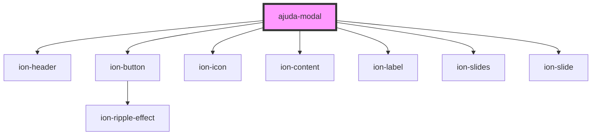

# ajuda-modal

<!-- Auto Generated Below -->

## Dependencies

### Depends on

- [ion-header](../../../../header)
- [ion-button](../../../../button)
- ion-icon
- [ion-content](../../../../content)
- [ion-label](../../../../label)
- [ion-slides](../../../../slides)
- [ion-slide](../../../../slide)

### Graph

----------------------------------------------

*Built with [StencilJS](https://stenciljs.com/)*
