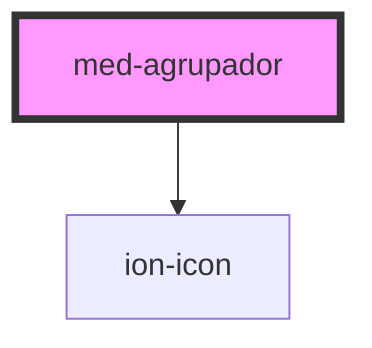

# med-agrupador

<!-- Auto Generated Below -->

## Properties

| Property           | Attribute           | Description | Type                  | Default              |
| ------------------ | ------------------- | ----------- | --------------------- | -------------------- |
| `collapsed`        | `collapsed`         | todo        | `boolean`             | `false`              |
| `dsColor`          | `ds-color`          | todo        | `string \| undefined` | `undefined`          |
| `labelAlternativo` | `label-alternativo` | todo        | `string`              | `'Ocultar a lista'`  |
| `labelDefault`     | `label-default`     | todo        | `string`              | `'Expandir a lista'` |

## Methods

### `toggle(event?: Event) => Promise<void>`

todo

#### Returns

Type: `Promise<void>`

## Dependencies

### Depends on

- ion-icon

### Graph

----------------------------------------------

*Built with [StencilJS](https://stenciljs.com/)*
