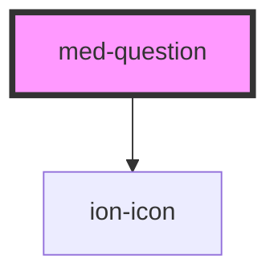

# med-question

<!-- Auto Generated Below -->

## Properties

| Property    | Attribute   | Description | Type                  | Default     |
| ----------- | ----------- | ----------- | --------------------- | ----------- |
| `collapsed` | `collapsed` | todo        | `boolean`             | `false`     |
| `dsColor`   | `ds-color`  | todo        | `string \| undefined` | `undefined` |
| `texto`     | `texto`     | todo        | `string \| undefined` | `undefined` |

## Dependencies

### Depends on

- ion-icon

### Graph

----------------------------------------------

*Built with [StencilJS](https://stenciljs.com/)*
