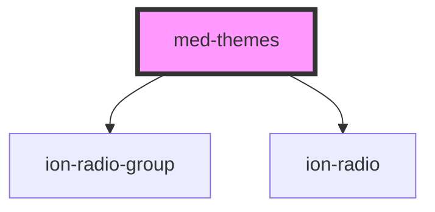

# med-theme

<!-- Auto Generated Below -->

## Properties

| Property | Attribute | Description | Type                     | Default     |
| -------- | --------- | ----------- | ------------------------ | ----------- |
| `ativo`  | `ativo`   | todo        | `string \| undefined`    | `undefined` |
| `temas`  | --        | todo        | `MedTema[] \| undefined` | `undefined` |

## Events

| Event       | Description | Type                  |
| ----------- | ----------- | --------------------- |
| `medChange` | todo        | `CustomEvent<string>` |

## Dependencies

### Depends on

- [ion-radio-group](../../../radio-group)
- [ion-radio](../../../radio)

### Graph

----------------------------------------------

*Built with [StencilJS](https://stenciljs.com/)*
