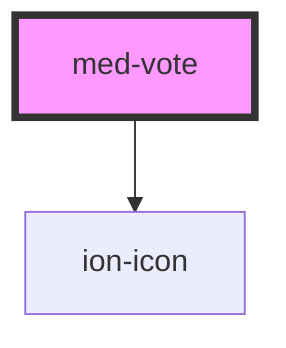

# med-vote

<!-- Auto Generated Below -->

## Properties

| Property | Attribute | Description | Type                  | Default           |
| -------- | --------- | ----------- | --------------------- | ----------------- |
| `like`   | `like`    | todo        | `number`              | `0`               |
| `titulo` | `titulo`  | todo        | `string \| undefined` | `'Cabe recurso?'` |
| `unlike` | `unlike`  | todo        | `number`              | `0`               |

## Dependencies

### Depends on

- ion-icon

### Graph

----------------------------------------------

*Built with [StencilJS](https://stenciljs.com/)*
