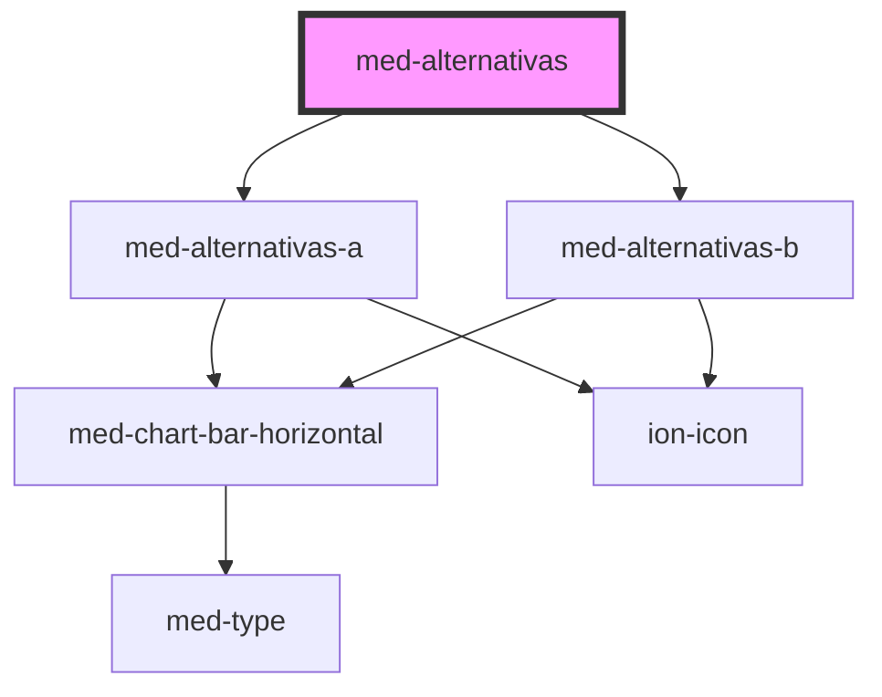

# med-alternativas

<!-- Auto Generated Below -->

## Properties

| Property                              | Attribute                 | Description | Type                  | Default         |
| ------------------------------------- | ------------------------- | ----------- | --------------------- | --------------- |
| `alternativaSelecionada` _(required)_ | `alternativa-selecionada` | todo        | `string`              | `undefined`     |
| `alternativas`                        | `alternativas`            | todo        | `any`                 | `[]`            |
| `dsColor`                             | `ds-color`                | todo        | `string \| undefined` | `undefined`     |
| `dsSkinConfig` _(required)_           | `ds-skin-config`          | todo        | `any`                 | `undefined`     |
| `keyAlternativa`                      | `key-alternativa`         | todo        | `string`              | `'Alternativa'` |
| `keyEnunciado`                        | `key-enunciado`           | todo        | `string`              | `'Enunciado'`   |
| `keyImagem`                           | `key-imagem`              | todo        | `string`              | `'Imagem'`      |
| `keyPorcentagem`                      | `key-porcentagem`         | todo        | `string`              | `'Porcentagem'` |
| `keyRiscada`                          | `key-riscada`             | todo        | `string`              | `'Riscada'`     |
| `mostraResposta` _(required)_         | `mostra-resposta`         | todo        | `boolean`             | `undefined`     |
| `permiteRiscar`                       | `permite-riscar`          | todo        | `boolean`             | `true`          |
| `respostaCorreta` _(required)_        | `resposta-correta`        | todo        | `string`              | `undefined`     |

## Dependencies

### Depends on

- [med-alternativas-a](../med-alternativas-a)
- [med-alternativas-b](../med-alternativas-b)

### Graph

----------------------------------------------

*Built with [StencilJS](https://stenciljs.com/)*
