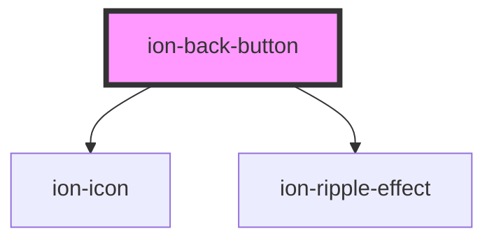

# ion-back-button

The back button navigates back in the app's history upon click. It is smart enough to know what to render based on the mode and when to show based on the navigation stack.

To change what is displayed in the back button, use the `text` and `icon` properties.


<!-- Auto Generated Below -->


## Usage

### Angular

```html
<!-- Default back button -->
<ion-header>
  <ion-toolbar>
    <ion-buttons slot="start">
      <ion-back-button></ion-back-button>
    </ion-buttons>
  </ion-toolbar>
</ion-header>

<!-- Back button with a default href -->
<ion-header>
  <ion-toolbar>
    <ion-buttons slot="start">
      <ion-back-button defaultHref="home"></ion-back-button>
    </ion-buttons>
  </ion-toolbar>
</ion-header>

<!-- Back button with custom text and icon -->
<ion-header>
  <ion-toolbar>
    <ion-buttons slot="start">
      <ion-back-button
          [text]="buttonText"
          [icon]="buttonIcon">
      </ion-back-button>
    </ion-buttons>
  </ion-toolbar>
</ion-header>

<!-- Back button with no text and custom icon -->
<ion-header>
  <ion-toolbar>
    <ion-buttons slot="start">
      <ion-back-button text="" icon="add"></ion-back-button>
    </ion-buttons>
  </ion-toolbar>
</ion-header>

<!-- Danger back button next to a menu button -->
<ion-header>
  <ion-toolbar>
    <ion-buttons slot="start">
      <ion-menu-button></ion-menu-button>
      <ion-back-button color="danger"></ion-back-button>
    </ion-buttons>
  </ion-toolbar>
</ion-header>
```


### Javascript

```html
<!-- Default back button -->
<ion-header>
  <ion-toolbar>
    <ion-buttons slot="start">
      <ion-back-button></ion-back-button>
    </ion-buttons>
  </ion-toolbar>
</ion-header>

<!-- Back button with a default href -->
<ion-header>
  <ion-toolbar>
    <ion-buttons slot="start">
      <ion-back-button default-href="home"></ion-back-button>
    </ion-buttons>
  </ion-toolbar>
</ion-header>

<!-- Back button with custom text and icon -->
<ion-header>
  <ion-toolbar>
    <ion-buttons slot="start">
      <ion-back-button text="Volver" icon="close"></ion-back-button>
    </ion-buttons>
  </ion-toolbar>
</ion-header>

<!-- Back button with no text and custom icon -->
<ion-header>
  <ion-toolbar>
    <ion-buttons slot="start">
      <ion-back-button text="" icon="add"></ion-back-button>
    </ion-buttons>
  </ion-toolbar>
</ion-header>

<!-- Danger back button next to a menu button -->
<ion-header>
  <ion-toolbar>
    <ion-buttons slot="start">
      <ion-menu-button></ion-menu-button>
      <ion-back-button color="danger"></ion-back-button>
    </ion-buttons>
  </ion-toolbar>
</ion-header>
```


### React

```tsx
import React from 'react';
import { IonBackButton, IonHeader, IonToolbar, IonButtons, IonMenuButton, IonContent } from '@ionic/react';

export const BackButtonExample: React.FC = () => (
  <IonContent>
    {/*-- Default back button --*/}
    <IonHeader>
      <IonToolbar>
        <IonButtons slot="start">
          <IonBackButton />
        </IonButtons>
      </IonToolbar>
    </IonHeader>

    {/*-- Back button with a default href --*/}
    <IonHeader>
      <IonToolbar>
        <IonButtons slot="start">
          <IonBackButton defaultHref="home" />
        </IonButtons>
      </IonToolbar>
    </IonHeader>

    {/*-- Back button with custom text and icon --*/}
    <IonHeader>
      <IonToolbar>
        <IonButtons slot="start">
          <IonBackButton text="buttonText" icon="buttonIcon" />
        </IonButtons>
      </IonToolbar>
    </IonHeader>

    {/*-- Back button with no text and custom icon --*/}
    <IonHeader>
      <IonToolbar>
        <IonButtons slot="start">
          <IonBackButton text="" icon="add" />
        </IonButtons>
      </IonToolbar>
    </IonHeader>

    {/*-- Danger back button next to a menu button --*/}
    <IonHeader>
      <IonToolbar>
        <IonButtons slot="start">
          <IonMenuButton />
          <IonBackButton color="danger" />
        </IonButtons>
      </IonToolbar>
    </IonHeader>
  </IonContent>
);
```


### Stencil

```tsx
import { Component, h } from '@stencil/core';

@Component({
  tag: 'back-button-example',
  styleUrl: 'back-button-example.css'
})
export class BackButtonExample {
  render() {
    const buttonText = "Custom";
    const buttonIcon = "add";

    return [
      // Default back button
      <ion-header>
        <ion-toolbar>
          <ion-buttons slot="start">
            <ion-back-button></ion-back-button>
          </ion-buttons>
        </ion-toolbar>
      </ion-header>,

      // Back button with a default href
      <ion-header>
        <ion-toolbar>
          <ion-buttons slot="start">
            <ion-back-button defaultHref="home"></ion-back-button>
          </ion-buttons>
        </ion-toolbar>
      </ion-header>,

      // Back button with custom text and icon
      <ion-header>
        <ion-toolbar>
          <ion-buttons slot="start">
            <ion-back-button
              text={buttonText}
              icon={buttonIcon}>
            </ion-back-button>
          </ion-buttons>
        </ion-toolbar>
      </ion-header>,

      // Back button with no text and custom icon
      <ion-header>
        <ion-toolbar>
          <ion-buttons slot="start">
            <ion-back-button text="" icon="add"></ion-back-button>
          </ion-buttons>
        </ion-toolbar>
      </ion-header>,

      // Danger back button next to a menu button
      <ion-header>
        <ion-toolbar>
          <ion-buttons slot="start">
            <ion-menu-button></ion-menu-button>
            <ion-back-button color="danger"></ion-back-button>
          </ion-buttons>
        </ion-toolbar>
      </ion-header>
    ];
  }
}
```


### Vue

```html
<template>
  <!-- Default back button -->
  <ion-header>
    <ion-toolbar>
      <ion-buttons slot="start">
        <ion-back-button></ion-back-button>
      </ion-buttons>
    </ion-toolbar>
  </ion-header>

  <!-- Back button with a default href -->
  <ion-header>
    <ion-toolbar>
      <ion-buttons slot="start">
        <ion-back-button default-href="home"></ion-back-button>
      </ion-buttons>
    </ion-toolbar>
  </ion-header>

  <!-- Back button with custom text and icon -->
  <ion-header>
    <ion-toolbar>
      <ion-buttons slot="start">
        <ion-back-button
            :text="buttonText"
            :icon="buttonIcon">
        </ion-back-button>
      </ion-buttons>
    </ion-toolbar>
  </ion-header>

  <!-- Back button with no text and custom icon -->
  <ion-header>
    <ion-toolbar>
      <ion-buttons slot="start">
        <ion-back-button text="" icon="add"></ion-back-button>
      </ion-buttons>
    </ion-toolbar>
  </ion-header>

  <!-- Danger back button next to a menu button -->
  <ion-header>
    <ion-toolbar>
      <ion-buttons slot="start">
        <ion-menu-button></ion-menu-button>
        <ion-back-button color="danger"></ion-back-button>
      </ion-buttons>
    </ion-toolbar>
  </ion-header>
</template>

<script>
import { IonButtons, IonHeader, IonMenuButton, IonToolbar } from '@ionic/vue';
import { defineComponent } from 'vue';

export default defineComponent({
  components: { IonButtons, IonHeader, IonMenuButton, IonToolbar }
});
</script>
```


## Properties

| Property          | Attribute      | Description                                                                                                                                                                                                                                                            | Type                                                    | Default     |
| ----------------- | -------------- | ---------------------------------------------------------------------------------------------------------------------------------------------------------------------------------------------------------------------------------------------------------------------- | ------------------------------------------------------- | ----------- |
| `color`           | `color`        | The color to use from your application's color palette. Default options are: `"primary"`, `"secondary"`, `"tertiary"`, `"success"`, `"warning"`, `"danger"`, `"light"`, `"medium"`, and `"dark"`. For more information on colors, see [theming](/docs/theming/basics). | `string \| undefined`                                   | `undefined` |
| `defaultHref`     | `default-href` | The url to navigate back to by default when there is no history.                                                                                                                                                                                                       | `string \| undefined`                                   | `undefined` |
| `disabled`        | `disabled`     | If `true`, the user cannot interact with the button.                                                                                                                                                                                                                   | `boolean`                                               | `false`     |
| `icon`            | `icon`         | The icon name to use for the back button.                                                                                                                                                                                                                              | `null \| string \| undefined`                           | `undefined` |
| `mode`            | `mode`         | The mode determines which platform styles to use.                                                                                                                                                                                                                      | `"ios" \| "md"`                                         | `undefined` |
| `routerAnimation` | --             | When using a router, it specifies the transition animation when navigating to another page.                                                                                                                                                                            | `((baseEl: any, opts?: any) => Animation) \| undefined` | `undefined` |
| `text`            | `text`         | The text to display in the back button.                                                                                                                                                                                                                                | `null \| string \| undefined`                           | `undefined` |
| `type`            | `type`         | The type of the button.                                                                                                                                                                                                                                                | `"button" \| "reset" \| "submit"`                       | `'button'`  |


## Shadow Parts

| Part       | Description                                                   |
| ---------- | ------------------------------------------------------------- |
| `"icon"`   | The back button icon (uses ion-icon).                         |
| `"native"` | The native HTML button element that wraps all child elements. |
| `"text"`   | The back button text.                                         |


## Dependencies

### Depends on

- ion-icon
- [ion-ripple-effect](../ripple-effect)

### Graph


----------------------------------------------

*Built with [StencilJS](https://stenciljs.com/)*
