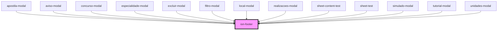

# ion-footer

Footer is a root component of a page that sits at the bottom of the page.
Footer can be a wrapper for ion-toolbar to make sure the content area is sized correctly.

<!-- Auto Generated Below -->


## Usage

### Angular / javascript

```html
<ion-content></ion-content>

<!-- Footer without a border -->
<ion-footer class="ion-no-border">
  <ion-toolbar>
    <ion-title>Footer - No Border</ion-title>
  </ion-toolbar>
</ion-footer>

<ion-footer>
  <ion-toolbar>
    <ion-title>Footer</ion-title>
  </ion-toolbar>
</ion-footer>
```


### React

```tsx
import React from 'react';
import { IonContent, IonFooter, IonToolbar, IonTitle } from '@ionic/react';

export const FooterExample: React.FC = () => (
  <>
    <IonContent />
    
    {/*-- Footer without a border --*/}
    <IonFooter className="ion-no-border">
      <IonToolbar>
        <IonTitle>Footer - No Border</IonTitle>
      </IonToolbar>
    </IonFooter>

    <IonFooter>
      <IonToolbar>
        <IonTitle>Footer</IonTitle>
      </IonToolbar>
    </IonFooter>
  </>
);
```


### Stencil

```tsx
import { Component, h } from '@stencil/core';

@Component({
  tag: 'footer-example',
  styleUrl: 'footer-example.css'
})
export class FooterExample {
  render() {
    return [
      <ion-content></ion-content>,

      // Footer without a border
      <ion-footer class="ion-no-border">
        <ion-toolbar>
          <ion-title>Footer - No Border</ion-title>
        </ion-toolbar>
      </ion-footer>,

      <ion-footer>
        <ion-toolbar>
          <ion-title>Footer</ion-title>
        </ion-toolbar>
      </ion-footer>
    ];
  }
}
```


### Vue

```html
<template>
  <ion-content></ion-content>
  
  <!-- Footer without a border -->
  <ion-footer class="ion-no-border">
    <ion-toolbar>
      <ion-title>Footer - No Border</ion-title>
    </ion-toolbar>
  </ion-footer>
  
  <ion-footer>
    <ion-toolbar>
      <ion-title>Footer</ion-title>
    </ion-toolbar>
  </ion-footer>
</template>

<script>
import { IonContent, IonFooter, IonTitle, IonToolbar } from '@ionic/vue';
import { defineComponent } from 'vue';

export default defineComponent({
  components: { IonContent, IonFooter, IonTitle, IonToolbar }
});
</script>
```


## Properties

| Property      | Attribute     | Description                                                                                                                                                                                                                                                                                                                           | Type            | Default     |
| ------------- | ------------- | ------------------------------------------------------------------------------------------------------------------------------------------------------------------------------------------------------------------------------------------------------------------------------------------------------------------------------------- | --------------- | ----------- |
| `mode`        | `mode`        | The mode determines which platform styles to use.                                                                                                                                                                                                                                                                                     | `"ios" \| "md"` | `undefined` |
| `translucent` | `translucent` | If `true`, the footer will be translucent. Only applies when the mode is `"ios"` and the device supports [`backdrop-filter`](https://developer.mozilla.org/en-US/docs/Web/CSS/backdrop-filter#Browser_compatibility).  Note: In order to scroll content behind the footer, the `fullscreen` attribute needs to be set on the content. | `boolean`       | `false`     |


## Dependencies

### Used by

 - [apostila-modal](../@templarios/ionic-1-migracao/duvidas-academicas/apostila-modal)
 - [aviso-modal](../@templarios/ionic-1-migracao/simulados/aviso-modal)
 - [concurso-modal](../@templarios/ionic-1-migracao/duvidas-academicas/concurso-modal)
 - [especialidade-modal](../@templarios/ionic-1-migracao/simulados/especialidade-modal)
 - [excluir-modal](../@templarios/ionic-1-migracao/duvidas-academicas/excluir-modal)
 - [filtro-modal](../@templarios/ionic-1-migracao/duvidas-academicas/filtro-modal)
 - [local-modal](../@templarios/ionic-1-migracao/simulados/local-modal)
 - [realizacoes-modal](../@templarios/ionic-1-migracao/simulados/realizacoes-modal)
 - [sheet-content-test](../@templarios/testes/sheet-content-test)
 - [sheet-test](../@templarios/testes/sheet-test)
 - [simulado-modal](../@templarios/ionic-1-migracao/duvidas-academicas/simulado-modal)
 - [tutorial-modal](../@templarios/ionic-1-migracao/simulados/tutorial-modal)
 - [unidades-modal](../@templarios/ionic-1-migracao/simulados/unidades-modal)

### Graph


----------------------------------------------

*Built with [StencilJS](https://stenciljs.com/)*
