# ion-header

Header is a parent component that holds the toolbar component.
It's important to note that ion-header needs to be the one of the three root elements of a page


<!-- Auto Generated Below -->


## Usage

### Angular / javascript

```html
<ion-header>
  <ion-toolbar>
    <ion-buttons slot="start">
      <ion-back-button></ion-back-button>
    </ion-buttons>
    <ion-title>My Navigation Bar</ion-title>
  </ion-toolbar>

  <ion-toolbar>
    <ion-title>Subheader</ion-title>
  </ion-toolbar>
</ion-header>

<!-- Header without a border -->
<ion-header class="ion-no-border">
  <ion-toolbar>
    <ion-title>Header - No Border</ion-title>
  </ion-toolbar>
</ion-header>

<ion-content>
  <ion-header collapse="condense">
    <ion-toolbar>
      <ion-title size="large">My Navigation Bar</ion-title>
    </ion-toolbar>
  </ion-header>
</ion-content>
```


### React

```tsx
import React from 'react';
import { IonHeader, IonContent, IonToolbar, IonButtons, IonBackButton, IonTitle } from '@ionic/react';

export const HeaderExample: React.FC = () => (
  <>
    <IonHeader>
      <IonToolbar>
        <IonButtons slot="start">
          <IonBackButton defaultHref="/" />
        </IonButtons>
        <IonTitle>My Navigation Bar</IonTitle>
      </IonToolbar>
    
      <IonToolbar>
        <IonTitle>Subheader</IonTitle>
      </IonToolbar>
    </IonHeader>
    
    {/*-- Header without a border --*/}
    <IonHeader className="ion-no-border">
     <IonToolbar>
      <IonTitle>Header - No Border</IonTitle>
     </IonToolbar>
    </IonHeader>
    
    <IonContent>
      <IonHeader collapse="condense">
        <IonToolbar>
          <IonTitle size="large">My Navigation Bar</IonTitle>
        </IonToolbar>
      </IonHeader>
    </IonContent>
  </>
);
```


### Stencil

```tsx
import { Component, h } from '@stencil/core';

@Component({
  tag: 'header-example',
  styleUrl: 'header-example.css'
})
export class HeaderExample {
  render() {
    return [
      <ion-header>
        <ion-toolbar>
          <ion-buttons slot="start">
            <ion-back-button></ion-back-button>
          </ion-buttons>
          <ion-title>My Navigation Bar</ion-title>
        </ion-toolbar>

        <ion-toolbar>
          <ion-title>Subheader</ion-title>
        </ion-toolbar>
      </ion-header>,

      // Header without a border
      <ion-header class="ion-no-border">
        <ion-toolbar>
          <ion-title>Header - No Border</ion-title>
        </ion-toolbar>
      </ion-header>,

      <ion-content>
        <ion-header collapse="condense">
          <ion-toolbar>
            <ion-title size="large">My Navigation Bar</ion-title>
          </ion-toolbar>
        </ion-header>
      </ion-content>
    ];
  }
}
```


### Vue

```html
<template>
  <ion-header>
    <ion-toolbar>
      <ion-buttons slot="start">
        <ion-back-button></ion-back-button>
      </ion-buttons>
      <ion-title>My Navigation Bar</ion-title>
    </ion-toolbar>
  
    <ion-toolbar>
      <ion-title>Subheader</ion-title>
    </ion-toolbar>
  </ion-header>
  
  <!-- Header without a border -->
  <ion-header class="ion-no-border">
    <ion-toolbar>
      <ion-title>Header - No Border</ion-title>
    </ion-toolbar>
  </ion-header>
  
  <ion-content>
    <ion-header collapse="condense">
      <ion-toolbar>
        <ion-title size="large">My Navigation Bar</ion-title>
      </ion-toolbar>
    </ion-header>
  </ion-content>
</template>

<script>
import { 
  IonBackButton, 
  IonButtons, 
  IonContent, 
  IonHeader, 
  IonTitle, 
  IonToolbar
} from '@ionic/vue';
import { defineComponent } from 'vue';

export default defineComponent({
  components: { 
    IonBackButton, 
    IonButtons, 
    IonContent, 
    IonHeader, 
    IonTitle, 
    IonToolbar
  }
});
</script>
```


## Properties

| Property      | Attribute     | Description                                                                                                                                                                                                                                                                                                                           | Type                      | Default     |
| ------------- | ------------- | ------------------------------------------------------------------------------------------------------------------------------------------------------------------------------------------------------------------------------------------------------------------------------------------------------------------------------------- | ------------------------- | ----------- |
| `collapse`    | `collapse`    | Describes the scroll effect that will be applied to the header `condense` only applies in iOS mode.  Typically used for [Collapsible Large Titles](https://ionicframework.com/docs/api/title#collapsible-large-titles)                                                                                                                | `"condense" \| undefined` | `undefined` |
| `mode`        | `mode`        | The mode determines which platform styles to use.                                                                                                                                                                                                                                                                                     | `"ios" \| "md"`           | `undefined` |
| `translucent` | `translucent` | If `true`, the header will be translucent. Only applies when the mode is `"ios"` and the device supports [`backdrop-filter`](https://developer.mozilla.org/en-US/docs/Web/CSS/backdrop-filter#Browser_compatibility).  Note: In order to scroll content behind the header, the `fullscreen` attribute needs to be set on the content. | `boolean`                 | `false`     |


## Dependencies

### Used by

 - [apostila-modal](../@templarios/ionic-1-migracao/duvidas-academicas/apostila-modal)
 - [concurso-modal](../@templarios/ionic-1-migracao/duvidas-academicas/concurso-modal)
 - [denunciar-modal](../@templarios/ionic-1-migracao/duvidas-academicas/denunciar-modal)
 - [dialog-test](../@templarios/testes/dialog-test)
 - [especialidade-modal](../@templarios/ionic-1-migracao/simulados/especialidade-modal)
 - [excluir-modal](../@templarios/ionic-1-migracao/duvidas-academicas/excluir-modal)
 - [filtro-modal](../@templarios/ionic-1-migracao/duvidas-academicas/filtro-modal)
 - [informativo-modal](../@templarios/ionic-1-migracao/apostila/informativo-modal)
 - [local-modal](../@templarios/ionic-1-migracao/simulados/local-modal)
 - [med-alert](../@templarios/core/med-alert)
 - [medreader-pro-modal](../@templarios/ionic-1-migracao/apostila/medreader-pro-modal)
 - [sheet-content-test](../@templarios/testes/sheet-content-test)
 - [sheet-test](../@templarios/testes/sheet-test)
 - [simulado-modal](../@templarios/ionic-1-migracao/duvidas-academicas/simulado-modal)
 - [text-area-modal](../@templarios/ionic-1-migracao/duvidas-academicas/text-area-modal)
 - [unidades-modal](../@templarios/ionic-1-migracao/simulados/unidades-modal)

### Graph

```mermaid
graph TD;
  apostila-modal --> ion-header
  concurso-modal --> ion-header
  denunciar-modal --> ion-header
  dialog-test --> ion-header
  especialidade-modal --> ion-header
  excluir-modal --> ion-header
  filtro-modal --> ion-header
  informativo-modal --> ion-header
  local-modal --> ion-header
  med-alert --> ion-header
  medreader-pro-modal --> ion-header
  sheet-content-test --> ion-header
  sheet-test --> ion-header
  simulado-modal --> ion-header
  text-area-modal --> ion-header
  unidades-modal --> ion-header
  style ion-header fill:#f9f,stroke:#333,stroke-width:4px
```


----------------------------------------------

*Built with [StencilJS](https://stenciljs.com/)*
