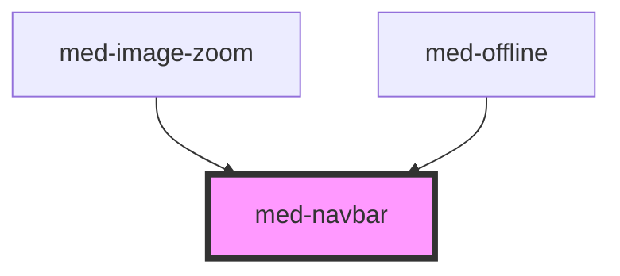

# med-navbar

<!-- Auto Generated Below -->

## Properties

| Property  | Attribute | Description | Type                                                   | Default     |
| --------- | --------- | ----------- | ------------------------------------------------------ | ----------- |
| `color`   | `color`   |             | `string \| undefined`                                  | `undefined` |
| `dsName`  | `ds-name` |             | `"secondary" \| "solid" \| "transparent" \| undefined` | `undefined` |
| `neutral` | `neutral` |             | `string \| undefined`                                  | `undefined` |

## Events

| Event       | Description | Type                                   |
| ----------- | ----------- | -------------------------------------- |
| `medResize` |             | `CustomEvent<navbarResizeEventDetail>` |

## Dependencies

### Used by

 - [med-image-zoom](../med-image-zoom)
 - [med-offline](../../01-core/med-offline)

### Graph

----------------------------------------------

*Built with [StencilJS](https://stenciljs.com/)*
