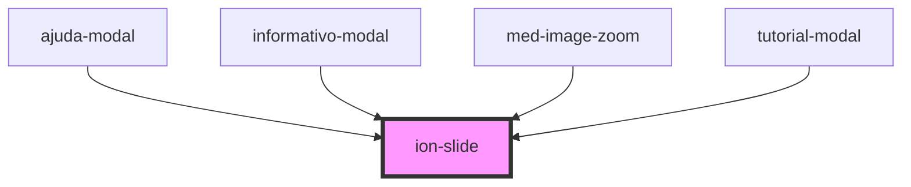

# ion-slide

The Slide component is a child component of [Slides](../slides). The template
should be written as `ion-slide`. Any slide content should be written
in this component and it should be used in conjunction with [Slides](../slides).

See the [Slides API Docs](../slides) for more usage information.

<!-- Auto Generated Below -->

## Dependencies

### Used by

 - [ajuda-modal](../@templarios/ionic-1-migracao/simulados/ajuda-modal)
 - [informativo-modal](../@templarios/ionic-1-migracao/apostila/informativo-modal)
 - [med-image-zoom](../@templarios/compositions/med-image-zoom)
 - [tutorial-modal](../@templarios/ionic-1-migracao/simulados/tutorial-modal)

### Graph

----------------------------------------------

*Built with [StencilJS](https://stenciljs.com/)*
